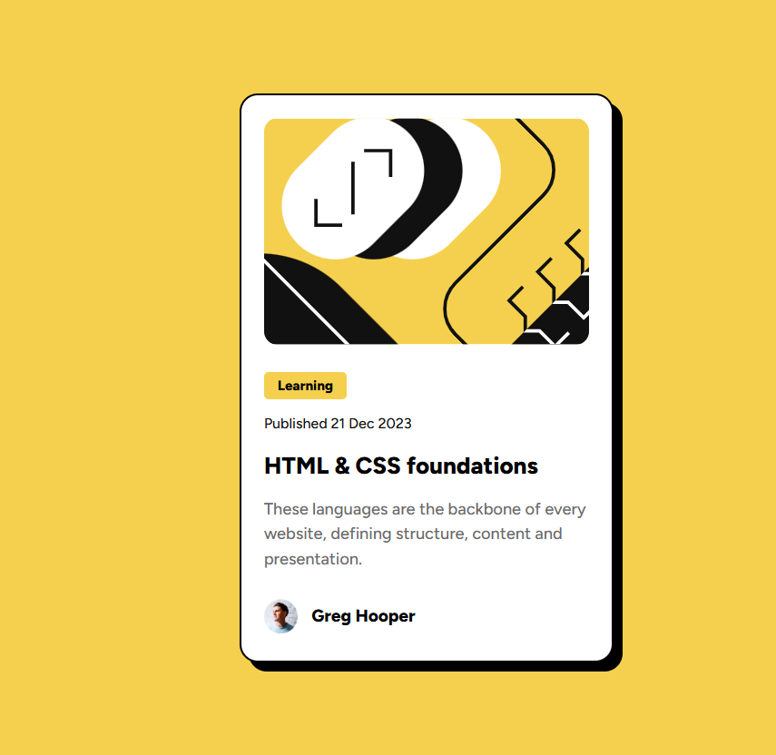

# Frontend Mentor - Blog preview card solution

This is a solution to the [Blog preview card challenge on Frontend Mentor](https://www.frontendmentor.io/challenges/blog-preview-card-ckPaj01IcS). Frontend Mentor challenges help you improve your coding skills by building realistic projects.

## Table of contents

- [Overview](#overview)
  - [The challenge](#the-challenge)
  - [Screenshot](#screenshot)
  - [Links](#links)
- [My process](#my-process)
  - [Built with](#built-with)
  - [What I learned](#what-i-learned)
  - [Continued development](#continued-development)
  - [Useful resources](#useful-resources)
- [Author](#author)

## Overview

### The challenge

Users should be able to:

- See hover and focus states for all interactive elements on the page

### Screenshot



### Links

- Solution URL: [Add solution URL here](https://your-solution-url.com)
- Live Site URL: [Add live site URL here](https://your-live-site-url.com)

## My process

### Built with

- Semantic HTML5 markup
- Tailwind CSS
- Flexbox

### What I learned

Continuing on from the QR Code component, this was definitely a step up, but i feel like i did pretty well, i learned how to style images, and what object fit actually does, also leaned more into how to do responsive components using tailwind, and box shadows.

```html

```

```html
<div
  class="flex flex-col text-left bg-white p-5 border-2 border-black rounded-2xl w-full max-w-[330px] gap-3 shadow-[8px_8px_0_0_rgb(0,0,0)]"
></div>
```

### Continued development

For the future, i want to learn how to operate with box shadows better, took basically just blind guessing as to how to configure the values, which isnt ideal, and also hone in on how images work, and how to style them.

### Useful resources

- [Tailwind Shadow Generator](https://folge.me/tools/tailwind-shadow-generator) - As I said, it took a lot of guessing, but this definitely helped with the shadows.
- [Tailwind Documentation](https://tailwindcss.com/) - Probably used it less than at first, but still really useful when i couldnt remember what different properties were.
- [W3schools Object Fit](https://www.w3schools.com/css/css3_object-fit.asp) - Since it was my first time working with object-fit, this also gave me a rough idea of how it works, but trying it myself kinda solidified it more.

## Author

- Frontend Mentor - [@denissoboslai13](https://www.frontendmentor.io/profile/denissoboslai13)
